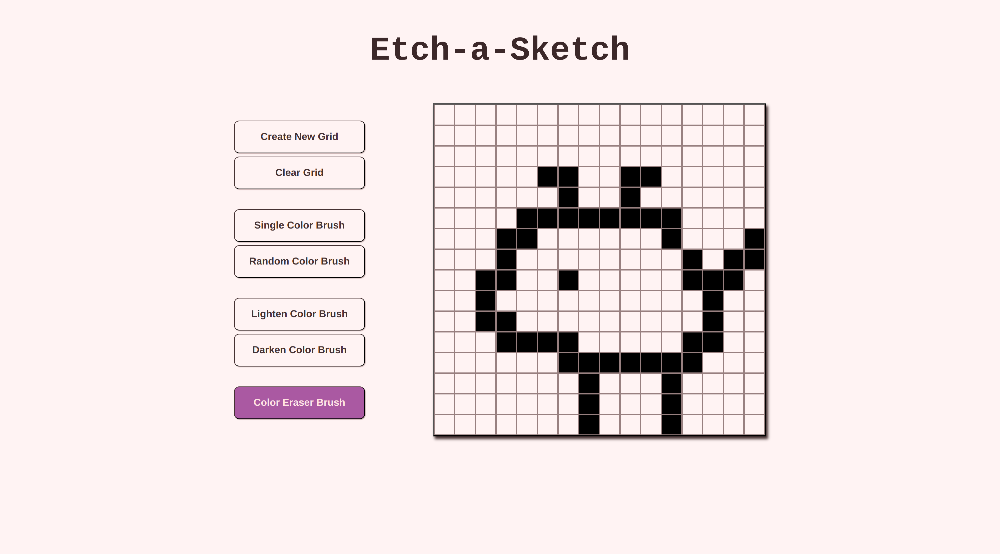

# Project: Etch-a-Sketch

## Project Preview

 

:link: A **live demo** of this project can be found
[here](https://potaytocheeps.github.io/etch-a-sketch/). 

## Description

This is my implementation of the
[Etch-a-Sketch Project](https://www.theodinproject.com/lessons/foundations-etch-a-sketch)
from [**The Odin Project**](https://www.theodinproject.com/) curriculum in the
JavaScript Basics section of the Foundations course.

Coming right after the [Rock Paper Scissors project](https://github.com/potaytocheeps/rock-paper-scissors)
in the curriculum, this Etch-a-Sketch project is meant to further push the knowledge that
we have acquired throughout this section of the curriculum. This project consists of
creating a web toy that is something between a sketchpad and an Etch A Sketch mechanical toy, and it
deals a lot more with DOM manipulation and event handling, and all of the basic
JavaScript skills overall.

## Features

- **Create** a grid of squares with a size ranging from 1x1 to 100x100.
- Paint grid cells to create pixel art with a black, **single color brush** or with
  a random array of colors with the **random color brush**.
- Change the shade of a colored grid cell by making it darker or lighter with the
  **lighten** and **darken** color brushes.
- Use the **color eraser brush** to delete the paint from any grid cell that has been
  previously colored.
- **Clear** the grid to revert it back to its original, unpainted status without needing
  to create a new grid each time.

## Concepts Applied

- This project makes use of **flexbox** for the layout and for creating the grid that will
  allow the user to paint.
- **Functions** and **event handlers** are the main focus of this project, keeping all of the
  code separate in their own functions and only being activated upon the user interacting
  with the buttons and the grid in the web page through the event handlers.
- **Selectors** are also greatly used to access and modify the content of the DOM elements
  necessary for the app to function.
- **Classes** are added and removed to some DOM elements, which allows for:
    - The user to paint over the cells in the grid.
    - The application of different styles based on whether or not a button is selected.
    - The grid to know whether or not the user is currently painting.
    - And for the grid cells to keep track of their darkened or lightened states, in
      comparison to their original colors.

## Reflection

A short blog post containing some of my thoughts on the project can be found
[here](https://potayto.notion.site/Project-Etch-a-Sketch-3f3509f078284e4197ca7f9fbe2018f7).
